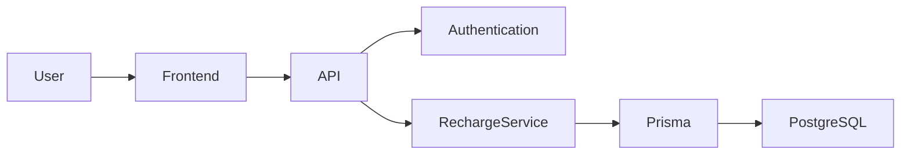
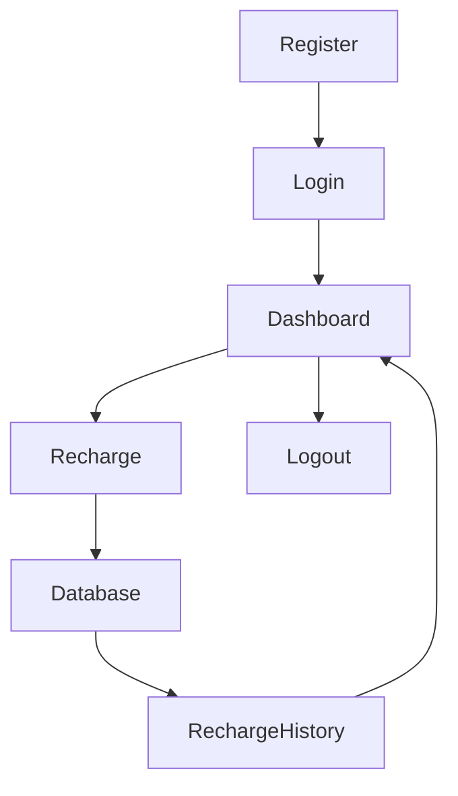
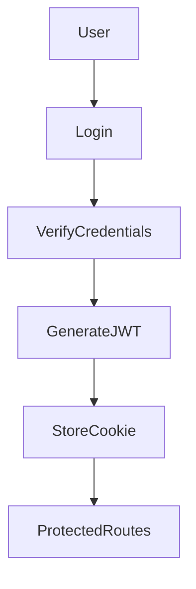

# 📱 Recharge System

A full-stack Recharge System built with **Next.js**, **React**, **Prisma ORM**, and **PostgreSQL**. The application allows users to securely register, log in, perform mobile recharges, and view their recharge history through a modern dashboard.

---

## 📖 Project Overview

The Recharge System is designed to simplify the mobile recharge experience while demonstrating modern full-stack web development practices. It includes secure authentication, recharge transaction management, history tracking, and a responsive user interface.

---

## 🚀 Features

- 🔐 User Registration
- 🔑 User Login
- 🍪 JWT Authentication using HTTP-only Cookies
- 📱 Mobile Recharge
- 📊 Dashboard
- 📜 Recharge History
- 🔍 Filter Recharge History
- 🚫 Duplicate Recharge Prevention
- 📈 Transaction Status Tracking
- 🚪 Secure Logout
- 📱 Responsive Design

---

## 🛠️ Tech Stack

### Frontend

- Next.js
- React.js
- Tailwind CSS

### Backend

- Next.js API Routes
- JWT Authentication

### Database

- PostgreSQL
- Prisma ORM

### Development Tools

- Git & GitHub
- VS Code
- Postman

---

## 📂 Project Structure

```text
paytm/
│
├── docs/
│   ├── PRD.md
│   ├── API.md
│   ├── backendArchitecture.md
│   └── frontendArchitecture.md
│
├── prisma/
│
├── src/
│   ├── app/
│   │   ├── api/
│   │   │   ├── auth/
│   │   │   └── recharge/
│   │   ├── dashboard/
│   │   ├── login/
│   │   ├── register/
│   │   └── page.jsx
│   │
│   ├── components/
│   └── globals.css
│
├── package.json
└── README.md
```

---

## 🏗️ System Architecture



---

## 🔄 Application Workflow



---

## 🔐 Authentication Flow



---

## 📡 API Endpoints

| Method | Endpoint | Description |
|---------|----------|-------------|
| POST | `/api/auth/register` | Register a new user |
| POST | `/api/auth/login` | Authenticate user |
| POST | `/api/auth/logout` | Logout user |
| POST | `/api/recharge` | Create a recharge |
| GET | `/api/recharge` | Fetch recharge history |
| GET | `/api/recharge/:id` | Fetch recharge details |

---

## 📚 Documentation

Detailed project documentation is available inside the `docs` folder.

| Document | Description |
|----------|-------------|
| `PRD.md` | Product Requirements Document |
| `API.md` | API Documentation |
| `backendArchitecture.md` | Backend Architecture |
| `frontendArchitecture.md` | Frontend Architecture |

---

## ⚙️ Installation

### Clone the Repository

```bash
git clone <repository-url>
```

### Navigate to the Project

```bash
cd paytm
```

### Install Dependencies

```bash
npm install
```

### Configure Environment Variables

Create a `.env` file.

```env
DATABASE_URL=your_database_url
JWT_SECRET=your_secret_key
```

---

## ▶️ Run the Development Server

```bash
npm run dev
```

Open your browser and visit:

```
http://localhost:3000
```

---

## 📸 Screenshots

You can add screenshots of:

- Landing Page
- Login Page
- Register Page
- Dashboard
- Recharge Form
- Recharge History

---

## 🔮 Future Enhancements

- Payment Gateway Integration
- SMS Notifications
- Email Notifications
- User Profile Management
- Admin Dashboard
- Analytics Dashboard
- Recharge Reports
- Dark Mode

---

## 👨‍💻 Author

**Madhav Sukhija**

Second-Year Computer Science Student

---

## 📄 License

This project is created for learning and educational purposes.