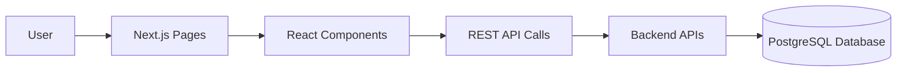
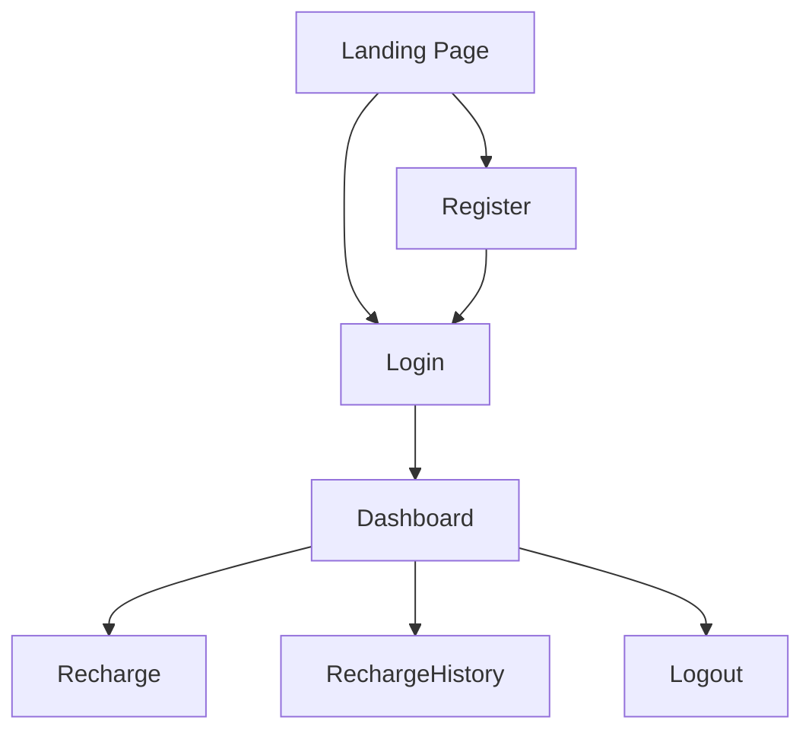
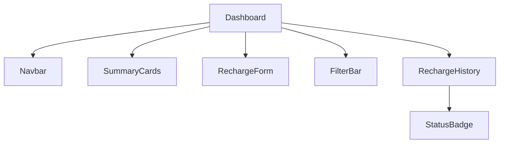
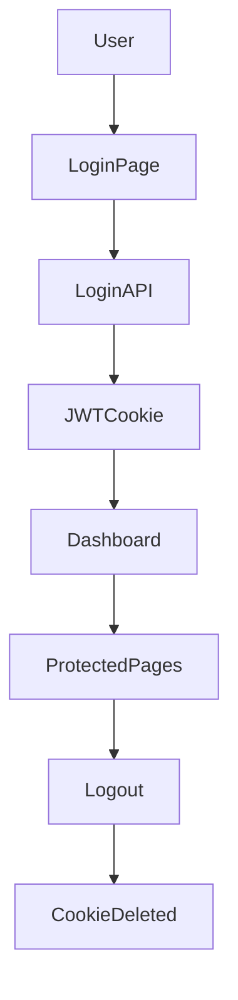
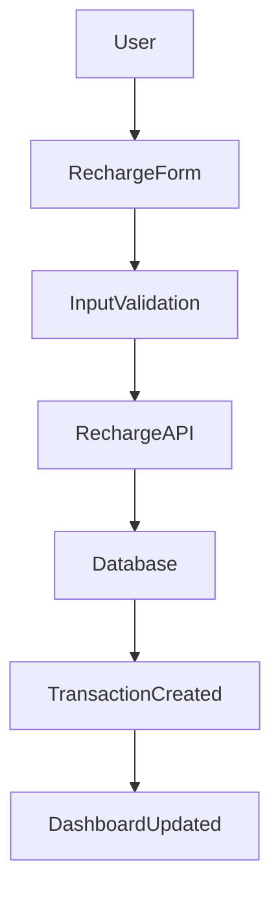
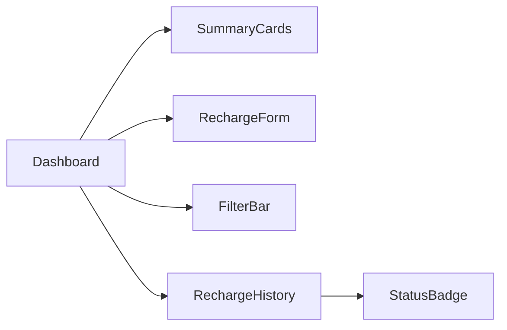
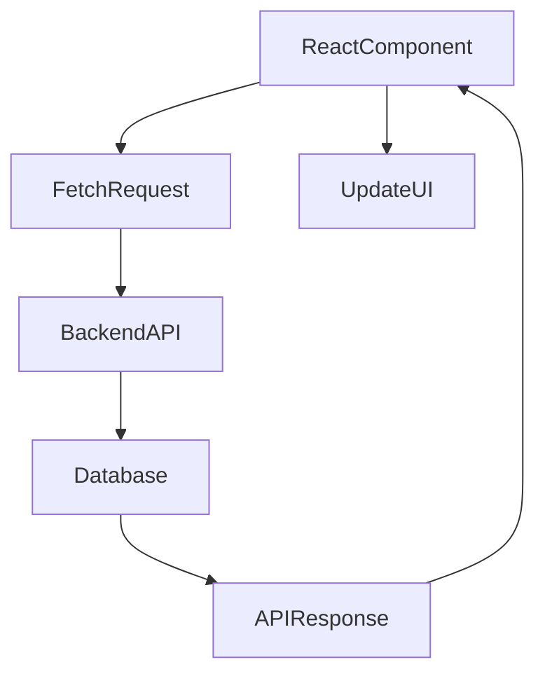
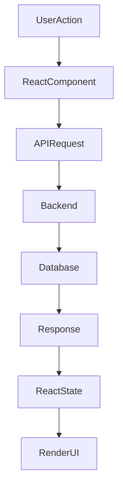
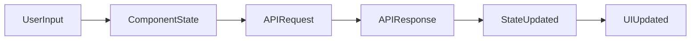
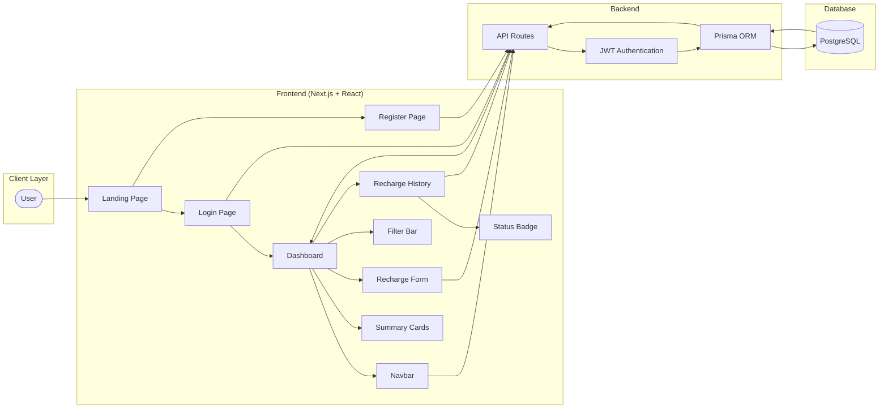

# Recharge System Frontend Architecture

Version: 1.0

---

# Overview

The Recharge System frontend is built using **Next.js App Router** and **React**. It provides an intuitive interface for user authentication, mobile recharge, recharge history, transaction tracking, and dashboard management.

The frontend communicates with the backend using REST APIs and uses JWT stored in HTTP-only cookies for secure authentication.

---

# Technology Stack

| Technology | Purpose |
|------------|---------|
| Next.js | React Framework |
| React | UI Development |
| Tailwind CSS | Styling |
| JavaScript | Application Logic |
| Fetch API | API Communication |
| JWT Cookies | Authentication |

---

# Frontend Folder Structure

```text
src
│
├── app
│   ├── api
│   │   ├── auth
│   │   └── recharge
│   │
│   ├── dashboard
│   │   └── page.jsx
│   │
│   ├── login
│   │   └── page.jsx
│   │
│   ├── register
│   │   └── page.jsx
│   │
│   ├── globals.css
│   ├── layout.jsx
│   └── page.jsx
│
├── components
│   ├── Navbar.jsx
│   ├── RechargeForm.jsx
│   ├── RechargeHistory.jsx
│   ├── FilterBar.jsx
│   ├── StatusBadge.jsx
│   └── SummaryCards.jsx
```

---

# Frontend Architecture



---

# Application Routing



---

# Component Hierarchy



---

# Authentication Flow



---

# Recharge Workflow



---

# Dashboard Workflow



---

# API Communication Flow



---

# Frontend Request Lifecycle



---

# State Management Flow



---

# Page Responsibilities

| Page | Responsibility |
|------|----------------|
| Landing Page | Entry point of the application |
| Login | User authentication |
| Register | User registration |
| Dashboard | Main application interface |

---

# Component Responsibilities

| Component | Responsibility |
|------------|----------------|
| Navbar | Navigation and Logout |
| RechargeForm | Create a new recharge |
| RechargeHistory | Display recharge transactions |
| FilterBar | Filter recharge history |
| StatusBadge | Show recharge status |
| SummaryCards | Display dashboard statistics |

---

# Frontend Security

- JWT Authentication
- HTTP-only Cookies
- Protected Dashboard Routes
- Client-side Input Validation
- Secure API Communication

---

# Future Enhancements

- Dark Mode
- User Profile Management
- Download Recharge Receipts
- Real-Time Status Updates using WebSockets
- Pagination for Recharge History
- Mobile Responsive Enhancements


